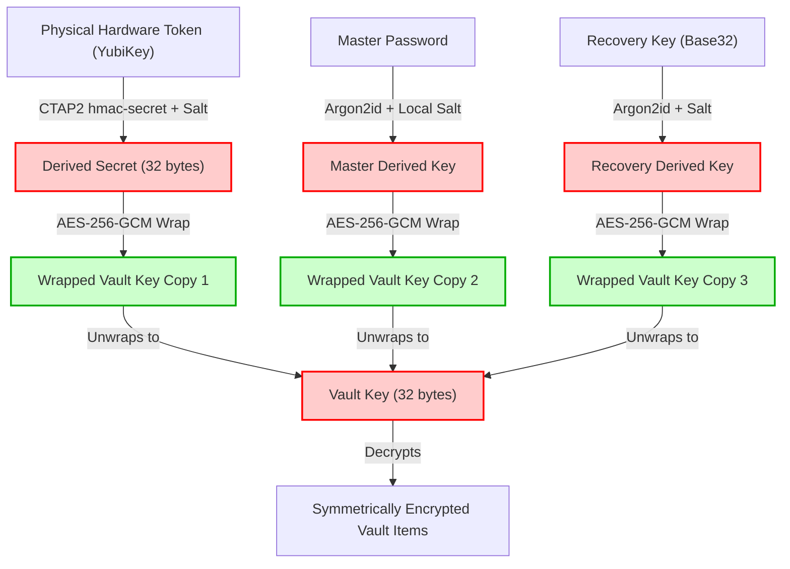

# FIDO2/CTAP2 Hardware Key Vault-Unlock Design

This document details the architectural and cryptographic design for using a hardware security key (e.g., YubiKey) as a local vault-unlock factor in SentinelVault.

---

## 1. Core Principles & Constraints

1. **Zero-Knowledge Principle**: The server must never see the Vault Key, the Master Password, or the symmetric secret returned by the hardware key.
2. **Additional Wrapping Layer**: The hardware key factor must *never* replace the Master Password. Instead, it acts as a parallel, optional key-wrapping envelope for the Vault Key (similar to biometric quick-unlock and the Emergency Kit Recovery Key).
3. **Graceful Degradation**: If the hardware key is lost, damaged, or stolen, the vault must not be bricked. The user must be able to unlock the vault using their Master Password or Recovery Key, after which they can revoke the lost hardware key configuration.
4. **CTAP2 Compliance**: Because a standard WebAuthn signature assertion does not yield a static, reusable key, we rely on the **FIDO2 CTAP2 `hmac-secret` extension** to derive a stable, high-entropy key from the hardware token.

---

## 2. Cryptographic Architecture

### Key Hierarchy and Relationships



### Encryption Ceremony (Registration)

When a user registers a hardware key for local unlock:

1. **Salt Generation**: The client generates a cryptographically secure random 32-byte salt (`hmacSalt`).
2. **FIDO2 Credential Creation**: The client calls FIDO2 `navigator.credentials.create` (or native platform equivalent) with the `hmac-secret` extension enabled.
3. **Secret Retrieval**: The authenticator evaluates the HMAC over the salt using its internal, non-exportable private key and returns a stable 32-byte output (`HmacSecretKey`).
4. **Key Wrapping**: The active 32-byte `VaultKey` is encrypted with the `HmacSecretKey` using **AES-256-GCM**:
   $$\text{Ciphertext, Tag} = \text{AES-GCM-Encrypt}(\text{Key} = \text{HmacSecretKey}, \text{Nonce} = \text{random 12 bytes}, \text{Plaintext} = \text{VaultKey})$$
5. **Metadata Storage**: The client stores the registration metadata locally (or syncs it to the backend as part of the user profile metadata):
   ```json
   {
     "credentialId": "base64url",
     "salt": "base64url",
     "nonce": "base64url",
     "encryptedVaultKey": "base64url"
   }
   ```

### Decryption Ceremony (Unlock)

To unlock the vault using the hardware key:

1. **Retrieve Metadata**: The client loads the credential metadata (the salt, credential ID, nonce, and ciphertext).
2. **Authenticator Assertion**: The client calls FIDO2 `navigator.credentials.get` passing the `credentialId` and the `hmac-secret` extension payload containing the stored `salt`.
3. **Secret Retrieval**: The authenticator prompts the user (PIN/touch) and returns the stable `HmacSecretKey`.
4. **Key Unwrapping**: The client decrypts the ciphertext using the `HmacSecretKey`, the stored nonce, and AES-256-GCM to retrieve the `VaultKey`.
5. **Memory Management**: The `HmacSecretKey` is immediately zeroed out in memory after decryption.

---

## 3. Salt Storage & Security Analysis

- **Public Salt**: The salt is not a secret. It is used as input to the hardware key's HMAC function. Even if the salt is exposed in the local SQLite database or synced database, it is useless to an attacker because they lack the physical hardware token containing the internal device-bound key.
- **PIN/Biometric Requirement**: The FIDO2 standard enforces User Verification (UV) via PIN or biometric touch. An attacker who steals the hardware key cannot generate the `HmacSecretKey` without satisfying the PIN/biometric verification on the authenticator.
- **Brute Force Mitigation**: FIDO2 authenticators lock themselves after a small number of failed PIN attempts (typically 3 to 8), preventing brute-force attacks on the PIN even if the physical token is stolen.

---

## 4. Hardware Key Loss & Recovery Flow

If the hardware key is lost, the user's data remains safe and accessible:

1. **Fallback Unlock**: The user initiates a fallback unlock by choosing to type their **Master Password** or typing their **Emergency Kit Recovery Key**.
2. **Vault Decryption**: The selected fallback method decrypts its respective wrapped Vault Key copy, gaining access to the vault.
3. **Revocation**: Once inside the dashboard, the user navigates to Settings and clicks **Remove Hardware Key**. This action:
   - Deletes the local metadata envelope corresponding to the lost hardware key.
   - Syncs the updated metadata structure to the backend.
4. **Optional Re-enrollment**: The user can register a new hardware key to re-enable the unlock option.
